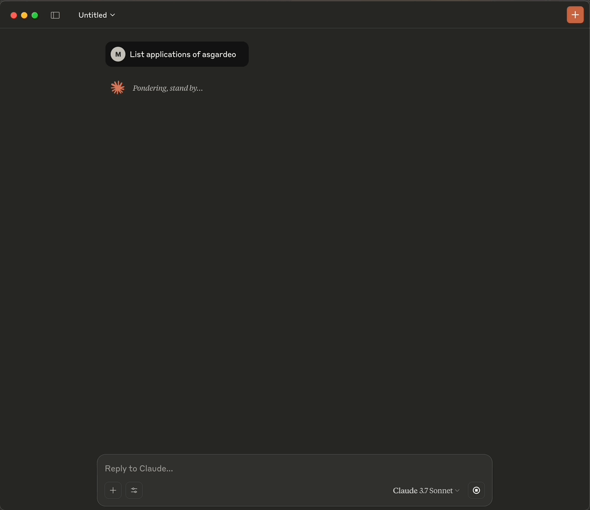
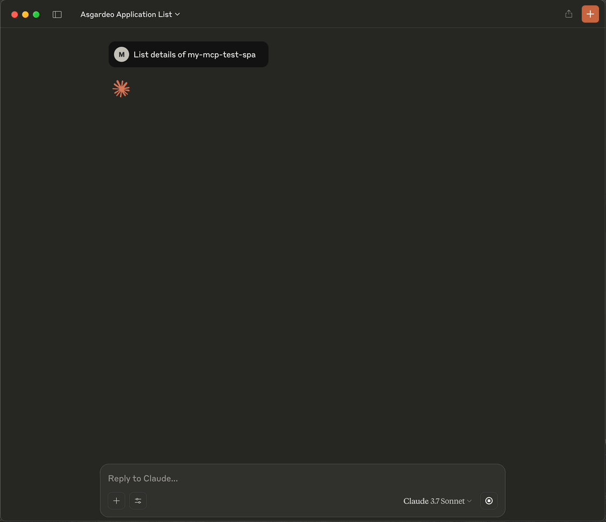

# Asgardeo MCP Server

The Asgardeo MCP Server allows you to manage your Asgardeo organization seamlessly using LLM tools, enabling natural language interactions for various configuration tasks.

> [!IMPORTANT]
> **Beta Release Notice**  
> This software is currently in beta and is not recommended for production environments.  
> - Features, APIs, and functionality are subject to change without prior notice.

### Key Use Cases
With tools like Claude Desktop, you can:

- **List Applications**: Retrieve a list of all applications in your Asgardeo organization.
- **Create Applications**: Set up single-page, web, mobile or m2m applications and integrate it with the Asgardeo authentication SDK.
- **Retrieve Application Details**: Fetch detailed information about specific applications.
- **Configure Login Flows**: Customize the login flow of an application using natural language prompts and the available tools, enabling seamless user authentication experiences.

#### Demonstrations

- **Listing Applications in Claude**  
  

- **Fetching Application Details in Claude**  
  

---

## How to Use

### On Asgardeo

1. **Create an M2M Application**: Set up an M2M application in your Asgardeo organization.
2. **Authorize Management APIs**: Grant the following scopes to the application:

  | API | Scopes |
  |-----|--------|
  | Application Management API (`/api/server/v1/applications`) | `internal_application_mgt_view`, `internal_application_mgt_update`, `internal_application_mgt_create` |
  | API Resource Management API (`/api/server/v1/api-resources`) | `internal_api_resource_update`, `internal_api_resource_create`, `internal_api_resource_view` |
  | Identity Provider Management API (`/api/server/v1/identity-providers`) | `internal_idp_view` |
  | Authenticators Management API (`/api/server/v1/authenticators`) | `internal_authenticator_view` |
  | Claim Management API (`/api/server/v1/claim-dialects`) | `internal_claim_meta_view` |
  | SCIM2 Users API (`/scim2/Users`) | `internal_user_mgt_create` |
  | OIDC Scope Management API (`/api/server/v1/oidc/scopes`) | `internal_oidc_scope_mgt_view` |

3. **Copy Credentials**: Save the client ID and client secret of the M2M application.

### On Your Machine

4. **Clone the Repository**:
  ```bash
  git clone <repository-url>
  ```
5. **Install Dependencies**:
  ```bash
  go mod tidy
  ```
6. **Build the Executable**:
  ```bash
  go build -o asgardeo-mcp
  ```

7. **Configure Your MCP Client**:

#### VS Code (GitHub Copilot)

- Install the GitHub Copilot extension.
- Open VS Code Settings (`File > Preferences > Settings`).
- Search for "MCP" and edit the `settings.json` file:
  ```json
  "mcp": {
    "servers": {
        "asgardeo-mcp-server": {
            "type": "stdio",
            "command": "<absolute path to the asgardeo-mcp executable, e.g., /Users/<user directory>/<repository path>/asgardeo-mcp-server/asgardeo-mcp>",
            "args": [],
            "env": {
                "ASGARDEO_BASE_URL" : "https://api.asgardeo.io/t/<asgardeo organization>",
                "ASGARDEO_CLIENT_ID" : "<client ID>",
                "ASGARDEO_CLIENT_SECRET" : "<client secret>"
              }
            }
    }
    }
  ```
- Save the file and start the MCP server from `settings.json`.

#### Claude Desktop

- Open Claude Desktop and navigate to `Settings > Developer`.
- Edit the `claude_desktop_config.json` file:
  ```json
  "asgardeo-mcp": {
   "command": "<absolute path to the asgardeo-mcp executable, e.g., /Users/<user directory>/<repository path>/asgardeo-mcp-server/asgardeo-mcp>",
   "args": [],
   "env": {
    "ASGARDEO_BASE_URL": "https://api.asgardeo.io/t/<asgardeo organization>",
    "ASGARDEO_CLIENT_ID": "<client ID>",
    "ASGARDEO_CLIENT_SECRET": "<client secret>"
   }
  }
  ```
- Restart Claude Desktop.

#### Cursor

- Open Cursor and navigate to `Settings > MCP`.
- Edit the `mcp.json` file:
  ```json
  "asgardeo-mcp": {
   "command": "<absolute path to the asgardeo-mcp executable, e.g., /Users/<user directory>/<repository path>/asgardeo-mcp-server/asgardeo-mcp>",
   "args": [],
   "env": {
    "ASGARDEO_BASE_URL": "https://api.asgardeo.io/t/<asgardeo organization>",
    "ASGARDEO_CLIENT_ID": "<client ID>",
    "ASGARDEO_CLIENT_SECRET": "<client secret>"
   }
  }
  ```

---

## Available Tools

The Asgardeo MCP Server provides the following tools for interacting with your Asgardeo organization:

### Application Management

| Tool Name | Description | Parameters |
|-----------|-------------|------------|
| `list_applications` | Lists all applications in Asgardeo | None |
| `create_single_page_app` | Creates a new Single Page Application | `application_name` (required): Name of the application<br>`redirect_url` (required): Redirect URL for the application |
| `create_webapp_with_ssr` | Creates a new web application with server-side rendering | `application_name` (required): Name of the application<br>`redirect_url` (required): Redirect URL for the application |
| `create_mobile_app` | Creates a new Mobile Application | `application_name` (required): Name of the application<br>`redirect_url` (required): Redirect URL for the application |
| `create_m2m_app` | Creates a new Machine-to-Machine Application | `application_name` (required): Name of the application |
| `get_application_by_name` | Gets details of an application by name | `application_name` (required): Name of the application to search for |
| `get_application_by_client_id` | Gets details of an application by client ID | `client_id` (required): Client ID of the application |
| `update_application_basic_info` | Updates basic information of an application | `id` (required): ID of the application<br>`name`, `description`, `image_url`, `access_url`, `logout_return_url` (optional) |
| `update_application_oauth_config` | Updates OAuth/OIDC configurations of an application | `id` (required): ID of the application<br>`redirect_urls`, `allowed_origins`, `user_access_token_expiry_time`, `application_access_token_expiry_time`, `refresh_token_expiry_time`, etc. (optional) |
| `update_application_claim_config` | Updates claim configurations of an application | `id` (required): ID of the application<br>`claims` (required): Requested claims |
| `authorize_api` | Authorizes an application to access an API | `appId` (required): ID of the application<br>`id` (required): ID of the API resource<br>`policyIdentifier` (required, default: "RBAC"): Authorization policy<br>`scopes` (required): Scopes to authorize |
| `list_authorized_api` | Lists authorized API resources of an application | `app_id` (required): ID of the application |
| `update_login_flow` | Updates login flow in an application based on a natural language prompt | `app_id` (required): ID of the application<br>`user_prompt` (required): Natural language description of the desired login flow |

### API Resource Management

| Tool Name | Description | Parameters |
|-----------|-------------|------------|
| `list_api_resources` | Lists API resources in your Asgardeo organization | `filter` (optional): Filter expression<br>`limit` (optional): Maximum results to return |
| `search_api_resources_by_name` | Searches for API resources by name | `name` (required): Name of the API resource to search for |
| `get_api_resource_by_identifier` | Gets an API resource by its identifier | `identifier` (required): Identifier of the API resource |
| `create_api_resource` | Creates a new API resource | `identifier` (required): Identifier for the API resource<br>`name` (required): Name of the API resource<br>`requiresAuthorization` (required): Whether the API requires authorization<br>`scopes` (required): List of scopes for the API |

### User Management

| Tool Name | Description | Parameters |
|-----------|-------------|------------|
| `create_user` | Creates a user in your Asgardeo organization | `username` (required): Username<br>`password` (required): Password<br>`email` (required): Email address<br>`first_name` (required): User's first name<br>`last_name` (required): User's last name<br>`userstore_domain` (optional, default: "DEFAULT"): Userstore domain |

### Claim Management

| Tool Name | Description | Parameters |
|-----------|-------------|------------|
| `list_claims` | Lists claims in your Asgardeo organization | None |

---

## Example Prompts

### Application Management

- **Create a SPA**:
  ```
  Create a new Single Page Application named "My Demo App" with redirect URL "https://example.com/callback".
  ```

- **Update Application**:
  ```
  Update my application with ID "abc123" to have a new name "Updated App".
  ```

- **Update Application Login Flow**:
  ```
  Update the login flow of my application with ID "abc123" to Username and Password as the first step and Email OTP as the second step.
  ```

- **Update Application Claim Configuration**:
  ```
  Update the claim configuration of my application with ID "abc123" to include "username", and "last_name".
  ```

### API Resource Management

- **Create and Authorize API**:
  ```
  Create a new API resource named "Customer API" and authorize my application to access it with "read:customers" scopes.
  ```

### User Management

- **Create a User**:
  ```
  Create a test user with the username and email address 'test@example.com'.
  ```

### Claim Management

- **Get Claim list**:
  ```
  List all claims in my Asgardeo organization.
  ```

---

## Troubleshooting

### Authentication & Permissions
- **Invalid Credentials**: Verify your client ID, client secret, and organization name in the base URL
- **403 Forbidden**: Check if your M2M application has all required scopes authorized

### Setup & Connection
- **Build Issues**: Ensure Go 1.18+ is installed, run `go mod tidy` before building
- **MCP Connection**: Verify executable path is absolute and correct, check permissions (`chmod +x asgardeo-mcp`)

### Getting Help
If issues persist after troubleshooting:
- Check [GitHub issues](https://github.com/asgardeo/asgardeo-mcp-server/issues)
- Create a new detailed issue including error messages and environment info
- Join the WSO2 community forums for support

---

## Contributing

Contributions are welcome! Submit issues or pull requests via the [GitHub repository](https://github.com/asgardeo/asgardeo-mcp-server/issues).
